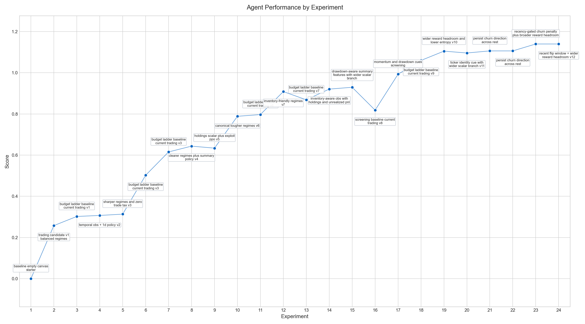

# autoRL




This repo is for autonomous research over RL environments that run atop [`simverse`](https://github.com/harshbhatt7585/simverse).

It can build RL environments and train it using a single `program.md` file.

Simverse designed as an abstraction layer which agent can use to build and train the env.


## Design principles

- keep the evaluator fixed
- keep the score fixed
- keep the mutable surface area tiny
- let the outer agent choose episode budget within hard caps
- keep the rest of the runtime stable enough that results stay interpretable

## Repo layout

- `candidate/env.py`: the editable `SimEnv` candidate, currently an intentionally empty starter canvas
- `candidate/train.py`: env-specific policy and PPO hyperparameters
- `framework.py`: fixed Simverse PPO evaluator and score
- `train.py`: fixed CLI entrypoint that prints comparable metrics
- `program.md`: instructions for the autonomous agent
- `vendor/simverse`: vendored upstream Simverse source

## Scoring philosophy

The fixed score is simple:

- `score = mean_eval_return`

That means the candidate is judged only by the average post-training episode
return across all greedy evaluation episodes and all seeds.

Other reported metrics such as solve rate, learning gain, stability, and
complexity penalty are still printed for debugging and analysis, but they no
longer affect the score.

## Quick start

Create a local virtual environment and install the vendored Simverse package:

```bash
python3 -m venv .venv
.venv/bin/pip install -e vendor/simverse
```

Run the fixed evaluator through that virtualenv:

```bash
.venv/bin/python train.py
```

Each run appends a summary row to `results.tsv`. You can also pass
`--description "..."` and optionally `--status pending|keep|discard` to label
that row.

The evaluator starts with small defaults but allows budget growth up to hard
caps:

- default `12` PPO training episodes
- default `8` greedy eval episodes
- hard cap `1000` PPO training episodes
- hard cap `100` greedy eval episodes
- `2` random seeds
- `32` parallel environments per seed

The intended workflow is to explore with small `--train-episodes` and
`--eval-episodes`, then ratchet them upward as the candidate gets stronger. The
rest of the evaluator should stay the same.

Task horizon is defined through the candidate hyperparameter surface in
`candidate/train.py` via `training_overrides()["max_steps"]`. The outer CLI
still controls only the number of PPO training episodes and greedy evaluation
episodes.

The checked-in candidate environment is intentionally minimal. The actual task
the agent should build belongs in `program.md`, not hardcoded in the baseline
starter env.

For an autonomous loop, initialize git first so the agent can keep or discard
environment mutations cleanly:

```bash
git init
git add .
git commit -m "Initial Simverse autoRL scaffold"
```

Then point your coding agent at `program.md`.

## How to run?

First give all permission to codex so it can run without interruption

As meontioned ins autoresearch you can spin the codex with this prompt and it will run continously

```text
Hi have a look at program.md and let's kick off a new experiment! let's do the setup first.

```

But I noticed that it stops after setting up, if it does then do this will continously trigger it even if it stops.

```bash
  nohup bash -lc '
  while true; do
    codex -a never -s workspace-write exec -C /Users/harshbhatt/Projects/autoRL "Continue the experiment loop in program.md from the current repo state. Read
  results.tsv, keep working on candidate/env.py and candidate/train.py, run another experiment, update results.tsv, and do not stop after a single accepted
  run. Only stop if the repo is broken or the process is interrupted."
    sleep 2
  done
  ' > .log/codex.log 2>&1 &
```

## Citations and Thank You
  - [Autoresearch](https://github.com/karpathy/autoresearch)
