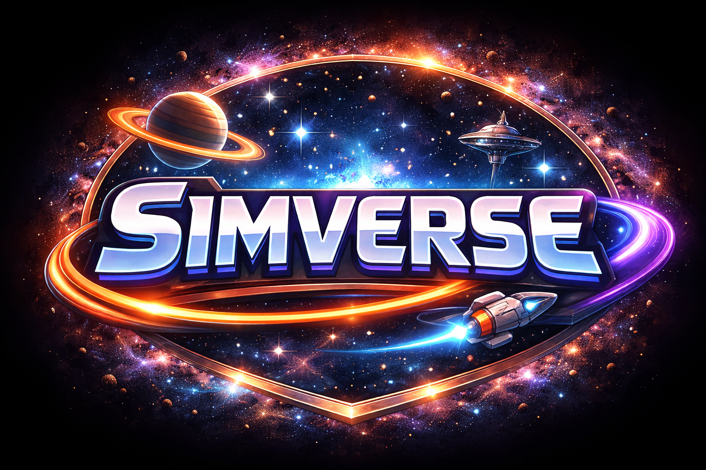

# Simverse



Simverse is a torch-native RL playground with built-in environments, policies, and PPO training utilities.

## Current Package Surface
- `SimEnv`, `SimAgent`, `Trainer`, and `Simulator` are the core abstractions.
- Built-in environments: `battle_grid`, `farmtila`, `gym_env`, `maze_race`, and `snake`.
- Built-in policies: `SimplePolicy`, `RandomPolicy`, and `CentralizedCritic`.

## Package Layout
- `simverse.core` holds the runtime abstractions and simulator orchestration.
- `simverse.training` holds PPO, checkpointing, stats, logging, W&B config, and training helpers.
- `simverse.envs` holds the built-in environments and their training entrypoints.
- `renderer/` holds the browser replay UI and replay-serving backend.

## Quickstart
Use the lightweight rollout helper against any Gymnasium discrete-action environment:

```python
from simverse import quicktrain

stats = quicktrain(env_id="CartPole-v1", episodes=5, max_steps=200)
print(stats)
```

The same helper is available via the package CLI:

```bash
sim rollout --env-id CartPole-v1 --episodes 5 --max-steps 200
```

## Development Setup
1. Install Simverse in editable mode with the dev extras:
   ```bash
   pip install -e .[dev]
   ```
2. To use PettingZoo Atari envs (like Tennis), install:
   ```bash
   pip install -e .[pettingzoo]
   ```
   Note: the Atari dependency stack currently requires Python `<3.13`.
3. To use browser replay serving from `sim train ... --replay`, install:
   ```bash
   pip install -e .[renderer]
   ```
4. Install the Git hooks so Ruff runs automatically:
   ```bash
   pre-commit install -c tooling/pre-commit-config.yaml
   ```
5. Run the hooks on demand (useful for CI or after large refactors):
   ```bash
   pre-commit run --all-files -c tooling/pre-commit-config.yaml
   ```

## UV Setup (Recommended)
1. Create a local virtual environment and install dependencies:
   ```bash
   ./scripts/setup_uv.sh dev
   ```
2. If you need Tennis/PettingZoo Atari support:
   ```bash
   ./scripts/setup_uv.sh all
   ```
3. Activate environment:
   ```bash
   source .venv/bin/activate
   ```

You can also run directly with `uv`:
- `uv sync` (base)
- `uv sync --extra dev` (base + dev)
- `uv sync --extra pettingzoo` (base + PettingZoo)
- `uv sync --extra dev --extra pettingzoo` (all)

## Training Entrypoints
Each environment exposes a Python `train(...)` function. The most direct way to use them today is from Python:

```python
from simverse.envs.gym_env.train import train as train_gym
from simverse.envs.snake.train import train as train_snake

train_gym(env_id="CartPole-v1", num_envs=512, episodes=120, use_wandb=False)
train_snake(num_envs=512, episodes=200, use_wandb=False)
```

`farmtila`, `maze_race`, and `battle_grid` follow the same pattern.

Device guidance from current Apple silicon benchmarks:
- use `cpu` when `num_envs < 128`
- use `mps` when `num_envs >= 128`

There is also a simple CLI entrypoint for built-in environments:

```bash
sim train battle-grid
```

Available names today: `battle-grid`, `farmtila`, `gym-env`, `maze-race`, and `snake`.

For supported replay environments, you can launch training with the replay backend and UI helpers:

```bash
sim train maze-race --replay
```

Current browser replay support: `battle-grid`, `maze-race`, and `snake`. Replays appear after each episode JSON is written during training.
